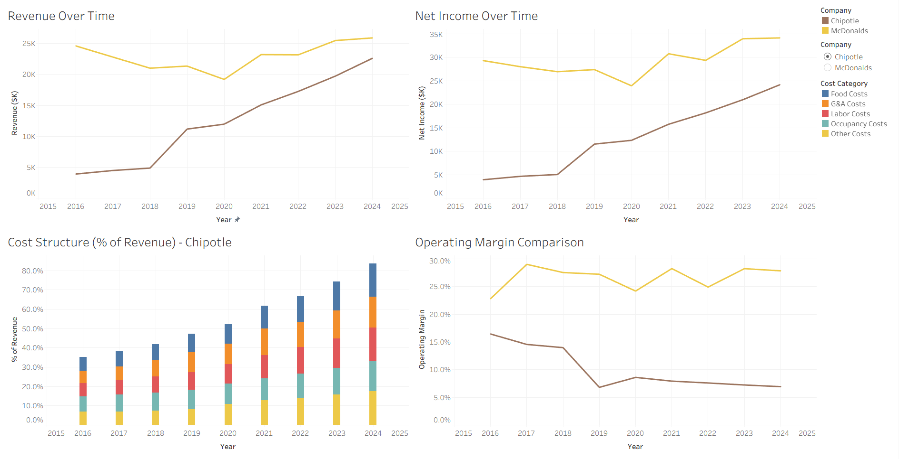
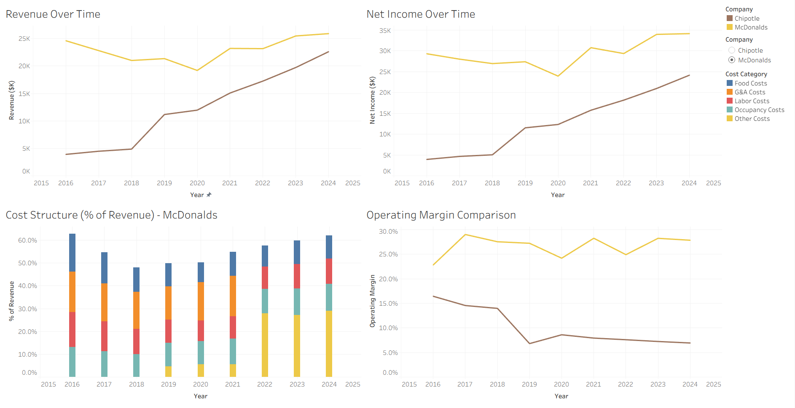

# Chipotle vs McDonalds: The Impact of COVID-19 on Financial Performance

## Project Overview

This project analyzes the financial performance of Chipotle and McDonald’s to evaluate the impact of COVID-19 on revenue growth, profitability, cost structure, and operational efficiency.

The analysis combines multi-year financial statement data and was developed using SQL and Tableau to create an interactive dashboard that highlights key trends before, during, and after the COVID-19 period.

---

## Data Source

The dataset was compiled from publicly available financial statement data sourced from SEC filings (10-K reports) for Chipotle and McDonald’s. The data included:

- Annual revenue figures
- Operating income and net income
- Detailed income statement line items
- Expense categories such as labor, food, and administrative costs

The financial data span fiscal years **2016 through 2024**, providing pre-COVID, COVID-era, and post-COVID context for comparative analysis.

The data were aggregated from multiple reporting periods and normalized to ensure consistency across companies.

---

## Tools Used

- SQL (SQLite)
- Tableau Public
- Data Cleaning and Transformation
- Data Modeling
- Data Visualization
- AI-assisted workflow (used for ideation, debugging, and refinement)

---

## Data Cleaning & Preparation

The following data preparation steps were performed:

- Standardized inconsistent metric naming across multiple datasets.
- Transformed wide-format financial statements into a long, analysis-ready format.
- Removed formatting artifacts (currency symbols, commas, parentheses) and converted values into numeric fields.
- Normalized units (thousands vs millions) to ensure comparability across companies.
- Filtered out non-operating and accounting adjustment entries to focus on core business performance.
- Structured data into a unified dataset for multi-company analysis.

---

## Dashboard Design & Analysis

The dashboard was designed to provide a comprehensive view of financial performance across key business dimensions.

Key design features include:

- Line charts showing revenue and net income trends over time
- A stacked bar chart illustrating cost structure as a percentage of revenue
- An operating margin comparison to evaluate efficiency
- Interactive filters allowing users to explore company-specific insights
- Clean, consistent visual formatting aligned with company branding

The dashboard enables users to analyze how each company responded to economic disruptions and evolving market conditions.

---

## Dashboard Screenshots

### Chipotle Selected

### McDonald’s Selected

---

## Key Insights

- Chipotle demonstrated strong revenue recovery following COVID-19, with consistent growth in later years.
- McDonald’s maintained relatively stable profitability, supported by its franchise-driven business model.
- Cost structures differed significantly between the two companies, with Chipotle exhibiting higher labor and food cost proportions.
- McDonald’s financial reporting structure changed over time, with certain cost categories consolidated into broader “Other” expenses after 2021.
- Operating margins revealed differing efficiency trends, highlighting how each company adapted to pandemic-related challenges.

---

## Impact and Application

This dashboard provides a clear and interactive view of comparative financial performance, enabling users to:

- Evaluate business resilience during economic disruptions.
- Identify differences in operational strategies between companies.
- Understand how cost structures influence profitability.
- Support data-driven analysis of corporate performance trends.

The analysis demonstrates how financial data can be transformed into actionable insights for strategic evaluation.

---

## Scope and Limitations

This analysis is based on publicly reported financial statement data and focuses on high-level income statement metrics. Variations in reporting structure between companies and across years required standardization, and certain assumptions were made to align cost categories.

Additionally, the analysis does not account for external macroeconomic factors beyond what are reflected in the financial performance data.

---

## Future Improvements

Future enhancements could include:

- Expanding analysis to include additional companies within the restaurant industry.
- Incorporating quarterly data for more granular trend analysis.
- Integrating macroeconomic indicators to contextualize performance.
- Developing predictive models to forecast revenue and profitability trends.
- Enhancing dashboard interactivity with advanced filtering and drill-down features.